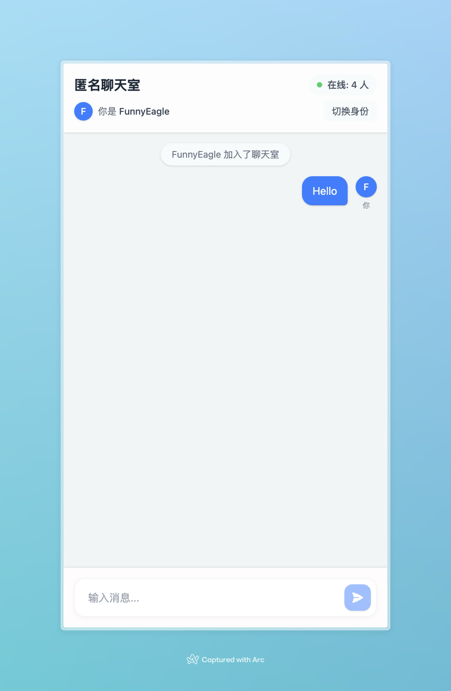

# Anonymous Chat 匿名聊天室

一个基于 React 和 Cloudflare Workers 构建的实时匿名聊天应用。用户可以在无需注册的情况下快速加入聊天，系统会自动分配一个随机的有趣昵称。

## ✨ 特性

- 🎭 完全匿名 - 自动生成有趣的随机昵称
- 🔄 实时通讯 - 基于 WebSocket 的即时消息传递
- 👥 在线状态 - 实时显示在线人数
- 🔄 身份切换 - 随时可以切换新的匿名身份
- 🎨 精美界面 - 现代化的 UI 设计和流畅的用户体验
- 🚀 高性能 - 基于 Cloudflare Workers 的分布式架构
- 📱 响应式设计 - 完美支持移动端和桌面端

## 🛠️ 技术栈

- **前端框架**: React 19
- **路由**: React Router 7
- **状态管理**: Zustand
- **样式**: TailwindCSS 4
- **后端服务**: Cloudflare Workers + Durable Objects
- **构建工具**: Vite
- **开发语言**: TypeScript
- **包管理器**: pnpm

## 📸 项目截图



## ⚠️ 前置要求

1. Node.js 18+
2. pnpm 8+
3. [Cloudflare Workers](https://workers.cloudflare.com/) 付费计划
   - 本项目使用了 Durable Objects 功能
   - 需要订阅 Workers Paid plan（每月 $5 起）

## 🚀 快速开始

### 安装依赖

```bash
pnpm install
```

### 本地开发

```bash
pnpm dev
```

访问 `http://localhost:5173` 即可看到应用。

### 生产环境构建

```bash
pnpm run build
```

### 部署

1. 首先确保你有 Cloudflare 账号并已订阅 Workers Paid 计划
2. 配置 Wrangler：
```bash
pnpm wrangler login
```
3. 部署到 Cloudflare Workers：
```bash
pnpm run deploy
```

## 🤝 贡献

欢迎提交 Issue 和 Pull Request！
